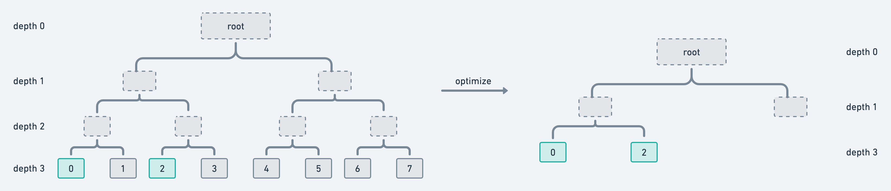
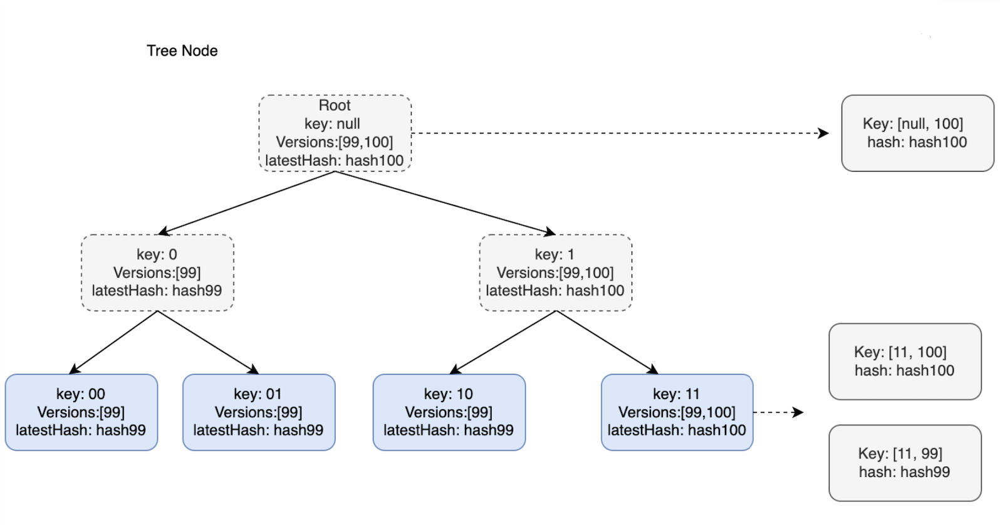
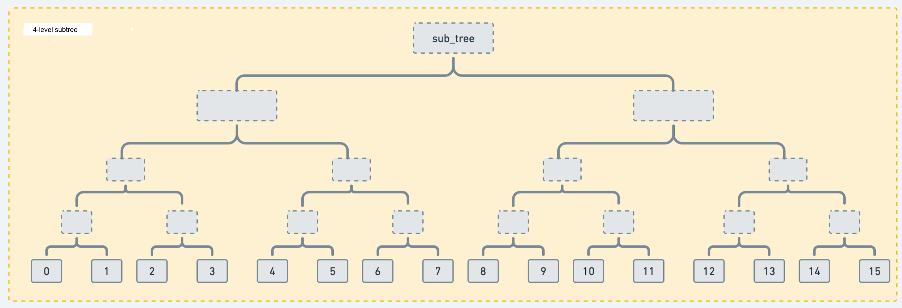

### Description
ZkBNB is an L2 solution based on zk-rollup, which is used to solve the problems of low transaction performance and high transaction fees on the chain. There is a concept of a world state in ZkBNB. All account data is organized in the form of a tree. The root hash value of the tree can identify a unique world state. At the same time, through the Merkle branch verification technology, it can be verified whether an account data belongs to the world state. This is also an important part of proving transaction validity in zk-rollup. This design document mainly focuses on the design of the world state tree in ZkBNB, including basic structure design, cache design, and persistence design.

### Design
#### SMT
The maximum height of SMT is determined. We assume that the leaf node height is 0, and our node height is maxHeight. nilHashes of different heights can be defined.
It can be expressed as a recursion:
```
nilHashes[0] = hash([]byte())
nilHashes[h] = hash(nilHashes[h-1], nilHashes[h-1])
```
If a node is high, it is an empty node, we use nlHashes[H] to represent it.
The definition of an empty node is 1. 2. All leaf nodes of the subtree represented by the intermediate node are empty nodes.

The hash algorithm is used to gradually generate intermediate nodes upwards from leaf nodes, until there is only one root node.

The existence proof of the leaf node mainly consists of two data: MerkleProof (uncle node hash by one) and ProofHelper (the position of the representation layer node). Proof of non-existence can be
  1. Prove that the value of the parent node of the leaf node is nilHash
  2. Prove that the value of the leaf node itself is nilhash

#### Optimization
The depth of SMT can be configured, and different depths of SMT can be selected according to different scenarios.
In general, the original SMT structure has the following optimizations:
1. For a subtree with only one leaf node, the subtree uses the leaf node instead
2. For a subtree with only one valid child intermediate node, the subtree uses the valid child intermediate node instead
3. For subtrees without leaf nodes, the subtree uses precomputed empty nodes instead


The above optimization points can reduce the calculation of hash times and reduce the occupation of node space. In the ZkBNB scenario, the required Merkle Proof size is fixed, so if the above optimization points are adopted, the hash calculation also needs to follow The native SMT tree method is used to calculate; for reducing the node space, the tree depth is large and the leaf node insertion is random. However, in ZkBNB, the insertion of the leaf node, that is, the account data, is dense and increasing, and the tree depth is at the same time. is 32, the space-saving advantage brought by optimization points 1 and 2 is not obvious, and also requires additional hash calculation. Therefore, ZkBNB Tree only adopts optimization point 3 to reduce the space overhead caused by empty subtrees.


In addition, we make full use of the certainty and order of keys to simplify the implementation of real-time prune.

#### Database
DB is mainly used to store tree node information, which is convenient for fast query, reconstruction, and multi-version switching functions. The main interfaces that rely on are `GetKV`, and `SetKV`, and complex indexing functions are not used, so it is more suitable to use KVDB. Faster, you can choose Leveldb or Rocksdb for the stand-alone version, and Tikv for the distributed version.

### Structure


BAS SMT has the following features: 

 - There is only one BAS SMT in the system. We store the list of version numbers that this Node has had in the Tree Node, as well as the hash value of the latest version. Use `t:depth:nibblePath` for indexing. 
 - The logical structure is a 2-ary tree. In order to ensure the simplicity of the proof calculation and to adapt to the zkSnark algorithm, the BAS SMT root hash is calculated using the native SMT calculation method, that is, the root hash value is obtained after a fixed number of hash calculations, for example, the SMT depth is 32 , then it takes 32 hash calculations to get the root hash value. 
 - The physical storage structure is a 16-ary tree: in order to minimize the number of disk reads involved in the process of accessing a leaf node at a time, when persisting BAS-SMT, 4 layers are converted to 1 layer for storage. 

#### Pros
1. `Hidden node relationships.` TreeNode does not point to the left and right child nodes through storage, and the relationship between nodes is hidden in the nibble path of TreeNode.
2. `O(1) access speed.` Profit and hidden node relationship, when we want to query the latest value of a node, we only need to visit the database once.
3. `Hot and cold cache.` Since SMT in ZkBNB is mainly used for updating, not querying, and revert does not occur in most cases, we can decide whether to keep it in memory according to the age of the latest version in Tree Node, In this way, the hot and cold cache is realized.
4. `Prune.` Suppose we need to save the data of the most recent N blocks, just insert the new version to the right when writing, and remove the old version

#### Cons
1. `Revert.` Rolling back to a certain version is no longer as simple as a multi-version tree. Each tree needs to be expanded from the root node in turn. As long as the version of the subtree is less than or equal to H-N, there is no need to continue to expand. For the expanded tree, the version is greater than H-N. node, delete unnecessary versions.
